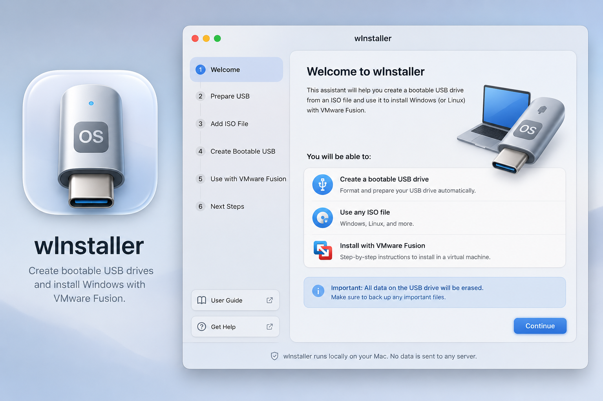

<p align="center">
  
</p>

<h1 align="center">wInstaller</h1>

<p align="center">
  A calm, native assistant for building bootable Windows and Linux USB installers —
  on macOS, Windows, and Linux. No telemetry, no uploads, everything local.
</p>

<p align="center">
  <a href="https://github.com/pedrobritx/winstaller/actions/workflows/ci-macos.yml"></a>
  <a href="https://github.com/pedrobritx/winstaller/actions/workflows/docs-lint.yml"></a>
  <a href="LICENSE.md"></a>
</p>

wInstaller helps you create bootable operating system USB drives and continue
into local virtualization, without learning disk utilities, ISO internals,
FAT32 limits, or boot firmware rules. The app explains what it is doing, asks
before destructive actions, validates the result, and keeps everything local.

**wInstaller is expanding from macOS-only to macOS, Windows, and Linux.** Each
platform gets a fully native UI — SwiftUI, WinUI 3, and GTK4/libadwaita — built
on one shared Rust core engine. See [Architecture](#architecture) below and
[docs/adr/](docs/adr/) for the full reasoning.

## Download

| macOS | Windows | Linux |
|---|---|---|
| [Releases](https://github.com/pedrobritx/winstaller/releases) | *Coming soon (Phase 3)* | *Coming soon (Phase 2)* |

Until signed release artifacts exist for a platform, build from source — see below.

## Status

The macOS app is feature-complete for the first-release happy path:

- Domain models and typed state machine (`WInstallerCore`)
- Unit + fixture tests (engine, parsers, executor)
- Real command runner (`Process`, argv-only) plus a dry-run runner for tests
- Live USB enumeration (`diskutil -plist`) with internal-disk filtering
- ISO mount + inspection (`hdiutil`, read-only)
- Real bootable-USB execution pipeline with the full safety gate
- VMware Fusion / UTM / Parallels detection and handoff
- Local logging with home-path redaction
- Liquid Glass SwiftUI interface (macOS 26) with native-material fallback
- App icon and `.app` packaging script

> **Safety note:** Real disk operations format the selected removable drive.
> Always verify the target and prefer the Simulate toggle first. Destructive
> operations have not been run on hardware in CI — test on a spare USB.

Windows and Linux native apps are planned (see [ROADMAP.md](docs/specs/ROADMAP.md) and the
phased delivery plan referenced from the ADRs).

## Building from source

### macOS

```bash
git clone https://github.com/pedrobritx/winstaller.git
cd winstaller

swift build
swift test
swift run WInstallerApp        # bare SwiftPM executable
# or: open Package.swift        # in Xcode
```

> **Build requirement for Liquid Glass:** the interface uses macOS 26 Liquid
> Glass APIs gated behind `if #available(macOS 26.0, *)`. Building requires the
> macOS 26 SDK (Xcode 26+); the app still runs on macOS 15 via the
> native-material fallback (deployment target stays at macOS 15).

To build a real `.app` bundle:

```bash
python3 Assets/Icon/generate_icon.py   # generate app icon assets
scripts/build-app.sh                   # assemble build/wInstaller.app
open build/wInstaller.app
```

With only the Xcode Command Line Tools installed (no full Xcode), `swift build`
and `swift run WInstallerApp` work as-is, but `swift test` needs extra flags
since the Swift Testing macro plugin and runtime framework aren't on the
default search paths:

```bash
swift test \
  -Xswiftc -plugin-path -Xswiftc /Library/Developer/CommandLineTools/usr/lib/swift/host/plugins/testing \
  -Xlinker -rpath -Xlinker /Library/Developer/CommandLineTools/Library/Developer/Frameworks \
  -Xlinker -rpath -Xlinker /Library/Developer/CommandLineTools/Library/Developer/usr/lib
```

**Requirements:** Swift 6.0+, macOS 15.0+, Xcode 16+ or Command Line Tools.

### Windows *(planned — Phase 3)*

The Windows app (WinUI 3 + C#/.NET, `apps/windows/`) does not exist yet. Once it
lands, build instructions will appear here (`dotnet build` against
`WInstaller.sln`).

### Linux *(planned — Phase 2)*

The Linux app (GTK4 + libadwaita, written in Rust, `apps/linux/`) does not exist
yet. Once it lands, build instructions will appear here (`cargo build`).

## Features

- Detect and verify ISO files.
- Detect Windows and Linux installation media.
- Detect removable USB drives and explain their current state.
- Confirm all destructive operations before erasing a drive.
- Format a selected USB drive for UEFI boot.
- Copy ISO contents to the USB drive.
- Split large Windows `install.wim` files when FAT32 limits require it.
- Validate the final bootable USB structure.
- Detect VMware Fusion and provide next-step guidance.
- Keep logs local and readable.
- Avoid telemetry, uploads, and hidden network behavior.

## Screenshot



## Why this exists

wInstaller should feel like something a first-party disk utility would be if it
actually explained itself: it explains what it found, asks before anything
destructive happens, validates the result, and never leaves the machine it runs
on. Read the [full manifesto on the landing page](https://pedrobritx.github.io/winstaller/)
or [VISION.md](docs/specs/VISION.md) for the complete set of interaction principles.

## Architecture

wInstaller is three native UIs sharing one Rust core engine:

- **macOS**: SwiftUI, calling into the core via a Swift wrapper package.
- **Windows**: WinUI 3 + C#/.NET, calling into the core via P/Invoke.
- **Linux**: GTK4 + libadwaita, written directly in Rust against the core crate
  (no FFI boundary).

The core (state machine, disk/ISO domain models, error taxonomy, and the
per-OS `SystemAdapter` trait) is the *only* shared layer — each UI is fully
native, with no cross-platform UI framework. See [ARCHITECTURE.md](docs/specs/ARCHITECTURE.md)
and every decision record under [docs/adr/](docs/adr/), starting with
[docs/adr/0001-core-language-and-ffi.md](docs/adr/0001-core-language-and-ffi.md).

## Documentation Map

- [PRODUCT.md](docs/specs/PRODUCT.md): mission, users, success criteria, and non-goals.
- [VISION.md](docs/specs/VISION.md): product philosophy and interaction principles.
- [REQUIREMENTS.md](docs/specs/REQUIREMENTS.md): functional and non-functional requirements.
- [USER_FLOW.md](docs/specs/USER_FLOW.md): screen-by-screen assistant flow.
- [ARCHITECTURE.md](docs/specs/ARCHITECTURE.md): app structure, modules, and state model.
- [UI_GUIDELINES.md](docs/specs/UI_GUIDELINES.md): per-OS interface rules.
- [DESIGN_SYSTEM.md](docs/specs/DESIGN_SYSTEM.md): reusable visual and component standards.
- [TERMINAL_AUTOMATION.md](docs/specs/TERMINAL_AUTOMATION.md): allowed commands, policies, and error recovery.
- [BOOTABLE_USB_ENGINE.md](docs/specs/BOOTABLE_USB_ENGINE.md): bootable media engine state machine.
- [VMWARE_INTEGRATION.md](docs/specs/VMWARE_INTEGRATION.md): virtualization detection and handoff behavior.
- [SECURITY.md](SECURITY.md): local-only trust model and permission strategy.
- [ICON_GUIDELINES.md](docs/specs/ICON_GUIDELINES.md): app icon and interface icon direction.
- [AI_RULES.md](docs/specs/AI_RULES.md): implementation rules for coding agents.
- [ROADMAP.md](docs/specs/ROADMAP.md): phased delivery plan.
- [docs/adr/](docs/adr/): architecture decision records for the multi-platform evolution.
- [docs/screen-inventory.yaml](docs/screen-inventory.yaml): canonical screen/step registry used for cross-platform parity checks.

## Contributing

Read [AI_RULES.md](docs/specs/AI_RULES.md) and [CONTRIBUTING.md](CONTRIBUTING.md) before
implementing a feature. Because the three UIs are separate native codebases
sharing only the core engine, a user-visible feature must be reflected across
all three (or explicitly tracked as pending) — see
[docs/adr/0008-feature-parity-enforcement.md](docs/adr/0008-feature-parity-enforcement.md).

## License

wInstaller is free to use, share, modify, and fork for any **noncommercial**
purpose (forks must remain noncommercial too). Commercial use requires a
separate license — see [COMMERCIAL-LICENSE.md](COMMERCIAL-LICENSE.md) for how
to request one. Full terms: [LICENSE.md](LICENSE.md).

## Developer

Built and maintained by Pedro Brito.

- [Linktree](https://pedrobritx.github.io/EwP)
- [Buy Me a Coffee](https://www.buymeacoffee.com/pedrobritx)
- [GitHub — Contribute](https://github.com/pedrobritx/winstaller)
